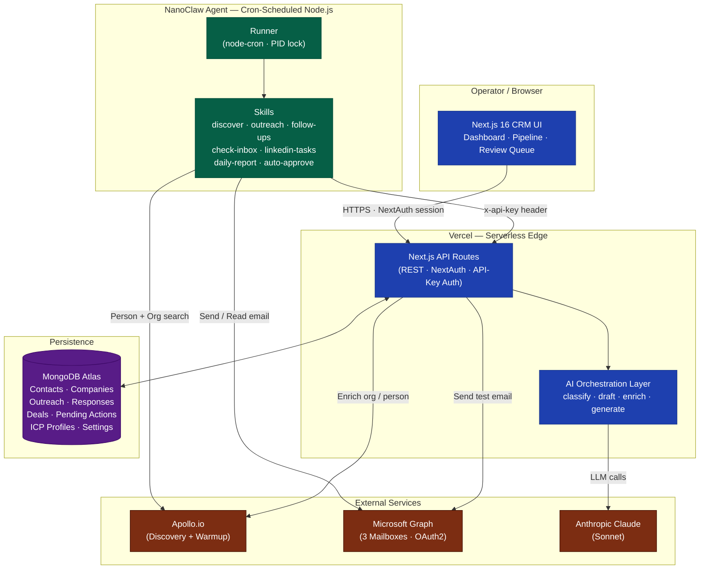

# SJ Wholesale — AI Outreach & Sales Intelligence Platform


> An autonomous, AI-orchestrated B2B outbound engine that discovers, qualifies, contacts, and classifies surplus-IT-equipment sellers at scale — turning a cold-calling operation into a self-running sales pipeline.

[](https://nextjs.org/)
[](https://react.dev/)
[](https://www.typescriptlang.org/)
[](https://tailwindcss.com/)
[](https://www.mongodb.com/atlas)
[](https://www.anthropic.com/)
[](https://learn.microsoft.com/en-us/graph/)
[](https://www.apollo.io/)
[](https://vercel.com/)

**Live App:** [sj-wholesale-crm.vercel.app](https://sj-wholesale-crm.example.com) *(auth-gated)*

---

## Overview

**The Problem.** B2B surplus-IT-equipment buying is bottlenecked by *discovery*, not capital. Sellers (school districts, data centers, MSPs, enterprises) only surface inventory on irregular refresh cycles, and finding the right decision-maker — a procurement lead, ITAD manager, or IT director — before a competitor does is the entire game. Traditional SDR teams don't scale, and off-the-shelf sales automation tools are too generic to sound human, too rigid to learn from responses, and too blunt to navigate deliverability risk across multiple mailboxes.

**The Solution.** This project is a vertically integrated platform that fuses a custom CRM with an autonomous outbound agent. It continuously:

- **Discovers** high-fit prospects using an Ideal Customer Profile (ICP) model derived from the existing customer base
- **Personalizes** cold outreach using a template + LLM hybrid generation pipeline
- **Sends** across three rotating mailboxes with per-sender daily limits and warmup monitoring
- **Classifies** inbound replies via a two-pass LLM pipeline that distinguishes hot leads from out-of-office auto-responders, referrals, and hard declines
- **Drafts** AI replies for human review, auto-creates deals, and routes edge cases to a review queue

The result: one operator runs the sales motion of a five-person SDR team, with full audit trails, rate-limited deliverability safeguards, and a closed feedback loop from won deals back into the ICP scoring model.

---

## High-Level Architecture



**Key design decisions:**

- **Agent is stateless.** All durable state lives in MongoDB behind the CRM's REST API. The agent can be killed, restarted, or migrated without losing context.
- **CRM is the system of record.** The agent never writes directly to the database — it calls authenticated REST endpoints, enabling independent deployment, audit logging, and replay.
- **Serverless-friendly model registration.** A centralized Mongoose barrel file ensures every schema is available for `.populate()` on every Vercel cold start, eliminating a class of `MissingSchemaError` failures common in serverless Node.js.

---

## Tech Stack & Tooling

### Frontend
- **Next.js 16** (App Router, standalone output, React Server Components)
- **React 19** · **TypeScript 5** · **Tailwind CSS v4**
- **Recharts** for analytics visualizations · **@hello-pangea/dnd** for the Kanban pipeline
- **NextAuth.js** (credentials provider, JWT sessions)

### Backend / API
- **Next.js API Routes** (REST, serverless functions)
- **Mongoose** ODM against **MongoDB Atlas**
- Dual authentication: NextAuth session cookies (UI) + shared API key via `x-api-key` header (agent-to-CRM)

### AI / LLM Orchestration
- **Anthropic Claude Sonnet** for:
  - Cold-message personalization (template-conditioned generation)
  - Two-pass response classification (intent → auto-reply subtype)
  - AI reply drafting with full conversation-thread context
  - Company enrichment, deal-stage coaching, email-signature parsing, ICP lookalike composite analysis
- Exponential-backoff retry wrapper (`withRetry`) for transient 5xx / timeout errors

### Agent Runtime
- **NanoClaw** — custom lightweight skills-based agent framework
- **node-cron** scheduler with per-skill timeouts and a PID-file single-instance lock
- **ESM-only**, zero-dependency skill modules that communicate via HTTP

### Integrations
- **Apollo.io** — person + organization search, email verification, mailbox warmup health
- **Microsoft Graph API** — multi-mailbox send, inbox polling, Sent Items sync (OAuth2 client-credentials flow)
- **Azure AD** — tenant-level app registration for Graph permissions

### DevOps
- **Vercel** — CRM hosting (serverless functions, preview deploys, standalone output)
- **VPS / self-hosted Node** — agent runtime (cron-driven, persistent)
- **Monorepo layout** (`crm/`, `nanoclaw/`, `shared/`)
- **Environment-aware runner** with `.env` merge precedence and a critical `CRM_URL` override guard

---

## Core Technical Challenges & Solutions

### 1 · ICP-Weighted Prospect Discovery with Two-Stage Dedup

**The Challenge.** Apollo.io charges credits per enriched contact. Spending those credits on people we've *already* contacted — or on companies that don't match our customer profile — is pure waste. We also needed discovery to evolve as the customer base grew, so early wins in (say) school districts would bias tomorrow's discovery toward more school districts, without hard-coding ratios.

**The Conceptual Approach.** A two-phase, budget-aware discovery pipeline runs every morning:

- **Phase A — ICP-Weighted Search.** The system loads every `CustomerProfile` record, computes the empirical distribution over company types (data center, school district, enterprise, MSP, VAR, etc.), and proportionally allocates the daily Apollo credit budget. If 40% of customers are data centers, ~40% of today's credits go toward data-center prospecting. When no ICP data exists, credits are split evenly across target types as a cold-start fallback.

- **Phase B — Lookalike Expansion.** Leftover credits feed a lookalike composite built from top-scoring customer profiles: their industries, employee ranges, geographic regions, and title keywords are aggregated into an Apollo search specification, and the system rotates through search variants using a persisted page-rotation state machine.

- **Two-Stage Deduplication — the critical optimization.** Before any Apollo enrichment credit is spent, the system queries the CRM's `Contact` collection for a match on `apolloId`. If found, the prospect is skipped *before* enrichment, preserving the credit. A second post-enrichment check matches on verified email and LinkedIn URL to catch contacts that predated the `apolloId` field, and back-fills the ID so future runs benefit. This pattern turned ~30% credit waste into near-zero on mature datasets.

- **Exclusion layer.** A multi-dimensional filter removes ITAD competitors (keyword match on "e-waste", "asset recovery", "liquidation", etc.), blocked domains, known contacts, and generic-email providers — applied before scoring so the priority queue is never polluted.

- **Priority Scoring.** Each surviving prospect receives a composite score combining company-type weight, role seniority, LinkedIn presence, company size, email availability, and three ICP-match bonuses (type, region, employee range). This score drives a diversified, round-robin-interleaved outreach queue so one company type can't monopolize a day's sends.

**Why This Matters.** The architecture scales *with* the business: as more customer profiles are tagged with deal outcomes, ICP weighting self-tunes, lookalike composites sharpen, and the cost-per-qualified-prospect drops. It's a closed-loop discovery system, not a static search.

---

### 2 · Two-Pass LLM Response Classification with Auto-Reply Subtype Extraction

**The Challenge.** Cold-email replies are a mix of hot leads, warm interest, polite declines, hard "stop contacting me" messages, referrals to other people, and — overwhelmingly — **automated out-of-office replies**. Treating an OOO bounce as a "response" would corrupt analytics, close pipelines prematurely, and suppress follow-ups that should actually resume after the person returns. A single-pass LLM classifier conflates these cases and loses the structured data needed to act on them.

**The Conceptual Approach.** Responses flow through a two-pass Claude pipeline:

- **Pass 1 — Context-Aware Classification.** The model receives the inbound message *plus* the last five outreach messages and last five prior responses for that contact, chronologically threaded. This gives Claude the full conversational arc — crucial for distinguishing "we already talked about this last month" from a fresh cold reply. Pass 1 emits one of eight top-level classes: `hot_lead`, `warm_lead`, `referral`, `info_request`, `soft_decline`, `hard_decline`, `auto_reply`, or `unrelated`, along with a confidence score and extracted fields (equipment types, quantity, timeframe, referral name/email, phone).

- **Pass 2 — Subtype Analysis (conditional).** If Pass 1 returns `auto_reply`, a second Claude call inspects the message body for fine-grained signal: Is there a return date? Did the person leave the company and redirect us? Is the mailbox unmonitored? Did they retire? This yields an `autoReplySubtype` like `ooo_with_date`, `left_company_redirect`, `retired`, or `mailbox_not_monitored` — each of which triggers a different downstream action:
  - `ooo_with_date` → schedule the next follow-up for the business day after the parsed return date
  - `left_company_redirect` / `retired` → *reclassify the entire response as a referral*, move the original contact to `do_not_contact`, and create a new contact from the extracted redirect info
  - `mailbox_not_monitored` → `do_not_contact`

- **Automated Side Effects.** `hot_lead` classifications automatically create a Deal in the pipeline, dispatch notifications, and generate an AI-drafted reply that lands in a human review queue. `hard_decline` closes all open AI-sourced deals and blocks future outreach. Every classification is versioned with `classifiedBy` (`ai` | `manual`) and `originalClassification` so manual overrides are auditable.

**Why This Matters.** Most CRMs treat inbound email as a flat "reply received" event. This design treats reply handling as a structured NLU problem and encodes the domain-specific logic (OOO dates drive scheduling; redirects become new contacts) directly into the orchestration layer — producing a genuinely autonomous response loop rather than a notification firehose.

---

### 3 · Multi-Sender Email Orchestration with Capacity-Aware Routing & Non-Idempotent Retry Semantics

**The Challenge.** Running outbound cold email from a single mailbox is a deliverability death sentence. But running from multiple mailboxes introduces three hard problems: (1) each mailbox has its own daily warmup limits, (2) follow-ups **must** come from the same sender as the original outreach for conversational integrity, and (3) `sendMail` is *not* idempotent — blindly retrying on transient failure causes duplicate sends, which destroys sender reputation.

**The Conceptual Approach.** The system operates three separately authenticated Microsoft Graph mailboxes, each with its own configurable daily send limit and enabled/disabled toggle. Routing decisions happen in two modes:

- **Initial Outreach — Capacity-Maximizing Selection.** For new prospects, `pickSenderForOutreach` picks the enabled sender with the *most remaining capacity today* — not round-robin. This keeps all three mailboxes warming evenly under variable load and maximizes total daily throughput without forcing any single account past its limit.

- **Follow-Ups — Sender Affinity.** For follow-ups, `pickSenderForFollowUp` looks up the `senderEmail` recorded on the original `initial` outreach and requires the follow-up to come from the same account. If that mailbox is at its daily limit, the contact is deferred to tomorrow rather than sent from a different address (which would break the conversation thread in the recipient's inbox and smell like spam). A legacy fallback to the default sender covers contacts imported before multi-sender was introduced.

- **Pre-Send Dedup Guard.** Before every send, the agent calls `hasRecentOutreach(contactId, "email", 60)` — a 60-minute sliding-window check against the CRM. This defends against race conditions where a hung skill, concurrent cron invocation, or manual trigger could double-schedule the same contact.

- **Asymmetric Retry Policy — the non-obvious part.** The system wraps *idempotent* operations (LLM message generation, CRM API calls) in an exponential-backoff retry helper keyed on a whitelist of transient error codes (`ECONNRESET`, `ETIMEDOUT`, 500/502/503/504/529). But `sendEmail` is **deliberately not retried**. A transient Graph failure is assumed to have potentially delivered the message; retrying risks a duplicate send. Instead, the failure is caught and converted into a `retry_send_email` PendingAction with `autoApproveAfterMinutes: 0`, surfacing it in the human review queue for manual decision. This inverts the usual "retry-everything" reflex and treats non-idempotency as a first-class property of the operation.

- **Sent Items Reconciliation.** A separate skill polls each mailbox's Sent folder and back-reconciles against the CRM's outreach log using `externalId = "sent:{graphMessageId}"` (sparse unique) plus a ±5-minute near-duplicate window — so emails sent from Outlook, the mobile app, or the agent all converge into one source of truth.

**Why This Matters.** This pattern — capacity-aware routing, sender affinity on follow-up, dedup-before-send, and *selective* retry based on idempotency — is the difference between a cold-email system that scales to thousands of prospects and one that gets every domain blacklisted in the first month. It's the kind of reliability engineering that most "AI SDR" tools skip entirely.

---

## Security & Infrastructure Highlights

### Authentication & Authorization
- **Dual auth model.** Web UI uses NextAuth.js with bcrypt-hashed credentials and JWT sessions; agent-to-CRM traffic uses a shared API key validated by a dedicated `api-auth` module on every protected route.
- **OAuth2 client-credentials flow** against Azure AD for Microsoft Graph, with no user-interactive tokens in the agent runtime.
- **Secrets segregation.** All credentials are environment-sourced and never committed. `.env` files are gitignored; the runner enforces an explicit `CRM_URL` unset guard to prevent shell-exported variables from silently overriding `.env` values (a subtle `dotenv` precedence bug).

### Rate Limiting & Deliverability
- **Per-mailbox daily caps** enforced in the agent and surfaced as CRM settings, not hardcoded.
- **Apollo credit budgeting** prevents runaway API spend via a daily credit limit and per-phase allocation.
- **Human-in-the-loop gates** on sensitive actions: AI-drafted replies, failed sends, and classification overrides all route through a PendingAction review queue with configurable auto-approve timeouts (0 for high-risk, 30 min for low-risk).
- **Conservative retry semantics** on non-idempotent operations (see Challenge 3 above) protect sender reputation.

### Reliability & Observability
- **Agent heartbeat webhook** tracks last-seen timestamps so stalled runners are detectable.
- **Audit trail on every action.** `AgentActivity` logs every skill invocation; `Outreach`, `Response`, `Deal.stageHistory`, and `PendingAction` all preserve the actor (`ai` vs `manual`) and timestamps.
- **Serverless cold-start hardening.** Centralized Mongoose model registration via a barrel file guarantees `.populate()` works on every Vercel invocation — a failure mode that silently degrades most serverless Node apps.
- **Single-instance PID lock** on the agent runner prevents accidental double-scheduling when a developer forgets a previous process is running.
- **Idempotent ingestion.** Every inbound response and every sent-item sync is keyed by an external ID (Graph message ID) with sparse unique indexes, plus a near-duplicate time window for messages that appear through multiple channels (direct send → sent-folder sync).

### Infrastructure Choices
- **Vercel serverless** for the CRM — preview deploys per branch, zero-ops scaling, automatic HTTPS, and standalone output for optional self-host portability.
- **MongoDB Atlas** for flexible schema evolution on a domain where adding new fields (auto-reply subtypes, ICP dimensions, new sender accounts) is a near-weekly occurrence.
- **Monorepo with a deprecated-agent archive** preserves institutional knowledge of the prior Playwright-based LinkedIn automation without polluting the live codebase.

---

## Monorepo Structure

```
sj-wholesale/
├── crm/                # Next.js 16 CRM (web UI + REST API + AI orchestration)
├── nanoclaw/           # Cron-scheduled outreach agent (skills + runner)
├── shared/             # Cross-package TypeScript types and constants
├── deprecated-agent/   # Archived Playwright-based agent (reference only)
└── cursor-prompts/     # Internal planning & architecture docs
```

---

*Built and operated by a single developer. Architecture, implementation, deployment, and daily operations end-to-end.*
